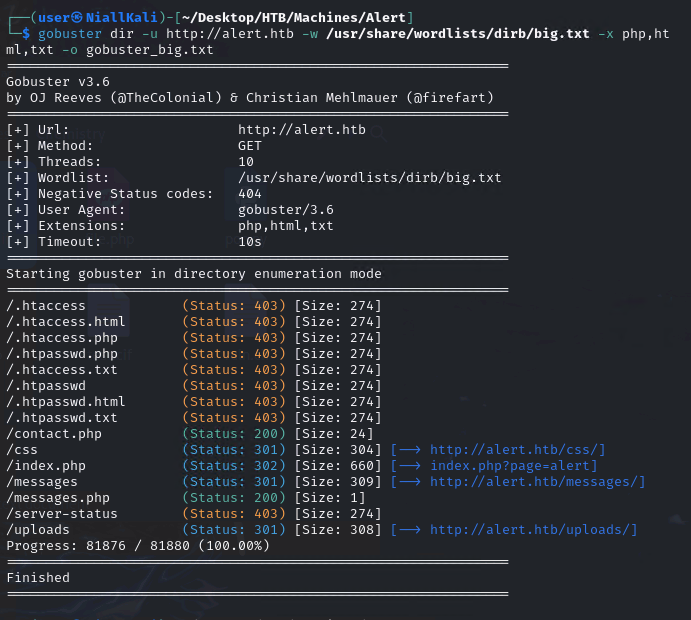
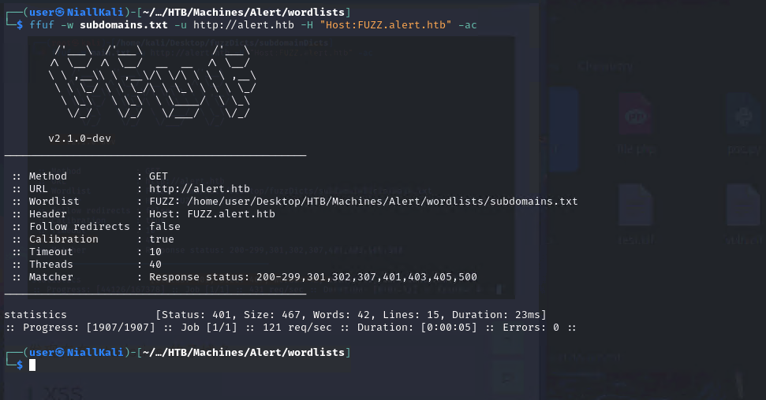

# Alert - Linux(Easy)

## Summary

## Enumeration
Begin enumeration on the host by running an Nmap scan. 

```
sudo nmap -sC -sV <target IP>

-sC default scripts
-sV Version Scan
```


We can see that ports 22 and 80 are open. It looks like an Apache web server is running on port 80.
We can add alert.htb to our /etc/hosts file and then try and view the web page.

```
sudo nano /etc/hosts
<target IP> alert.htb
```


We can try using gobuster to brute force a directory list and see if any of the directories contain any more information.
```
gobuster dir -u http://alert.htb -w /usr/share/wordlists/dirb/big.txt -x php,html,txt -o gobuster_big.txt
```
From checking the seen directories, no useful information is seen and we are denied access to most of them.



Next, we can fuzz for possible subdomains. We will use ffuf for this.

```
wget http://ffuf.me/wordlist/subdomains.txt
ffuf -w subdomains.txt -u http://alert.htb -H "Host:FUZZ.alert.htb" -ac
```



## Root


