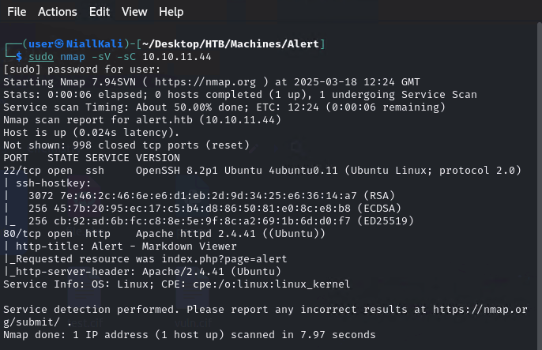
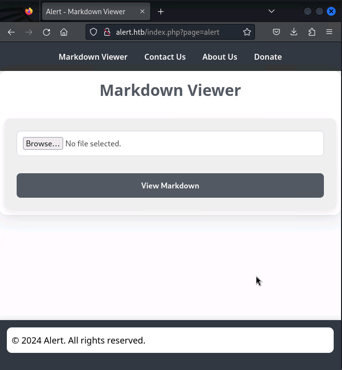
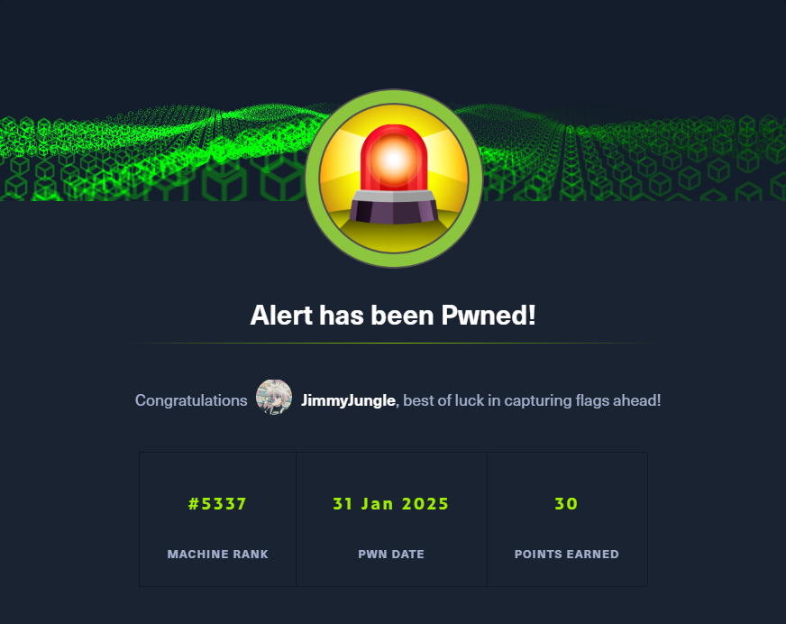

# Alert - Linux(Easy)

## Summary

## Enumeration
Begin enumeration on the host by running an Nmap scan. 

```
sudo nmap -sC -sV <target IP>

-sC default scripts
-sV Version Scan
```



We can see that ports 22 and 80 are open. It looks like an Apache web server is running on port 80.
We can add alert.htb to our /etc/hosts file and then try and view the web page.

```
sudo nano /etc/hosts
<target IP> alert.htb
```



## Root


